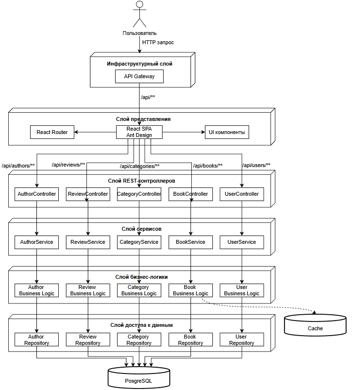
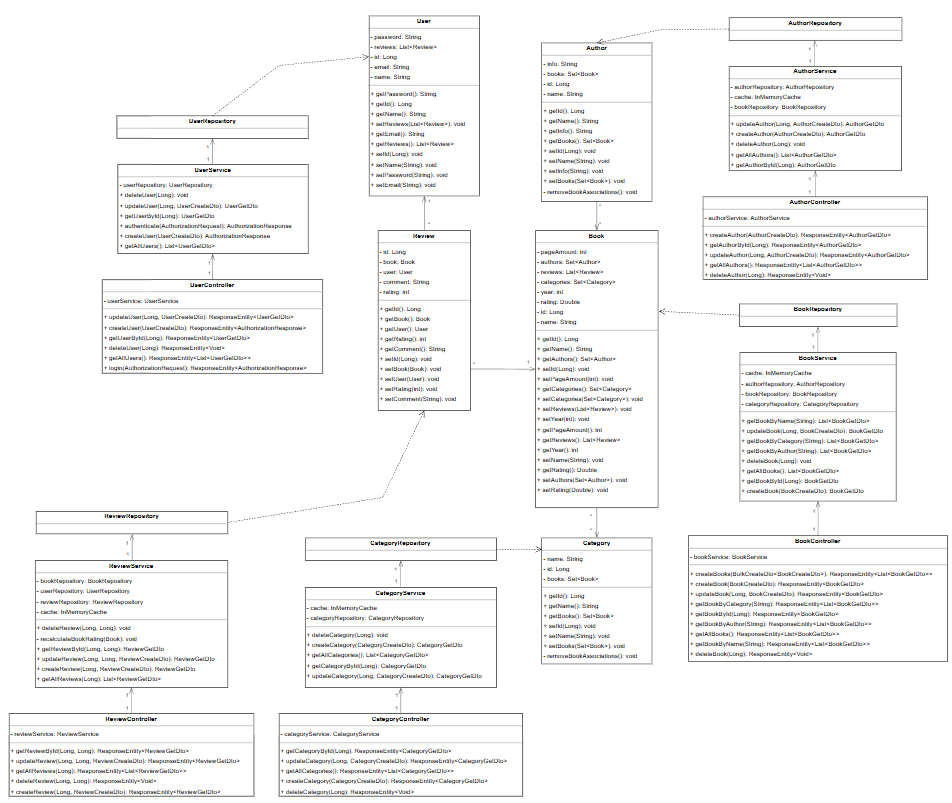

# Часть 1. Проектирование архитектуры «To Be»

# 1. Тип приложения

Данное приложение относится к типу веб-приложения. Приложения этого типа поддерживают сценарии с постоянным подключением и различные браузеры, выполняющиеся в разнообразнейших операционных системах и на разных платформах.

# 2. Стратегия развертывания

В данном приложении используется распределенное развертывание. В сценарии распределенного развертывания слой представления и бизнес-слой Веб-приложения располагаются на разных уровнях и взаимодействуют удаленно.

# 3. Обоснование выбора технологий

| Технология                      | Назначение | Обоснование |
|---------------------------------|------------|-------------|
| **Java 17 & Spring Boot 3.4.3** | Основной стек разработки бэкенда | Обеспечивает высокую производительность, зрелость экосистемы и быструю разработку RESTful сервисов. Встроенная поддержка JPA, валидации, безопасности и транзакций. |
| **PostgreSQL**                  | Реляционная база данных | Надёжная ACID-совместимая СУБД с поддержкой сложных связей между сущностями (книги, авторы, жанры, отзывы, пользователи). Бесплатный хостинг на Render.com. |
| **Spring Data JPA / Hibernate** | ORM для работы с БД | Упрощает маппинг Java-объектов на таблицы, поддерживает ленивую загрузку, кэширование и сложные запросы через JPQL. |
| **React 18+**                   | Фронтенд-библиотека | Компонентный подход, высокая производительность через виртуальный DOM, огромное сообщество и экосистема. |
| **Ant Design**                  | Библиотека UI-компонентов | Готовые адаптивные компоненты (таблицы, формы, модальные окна, уведомления), соответствующие современным стандартам UX. |
| **Axios**                       | HTTP-клиент для фронтенда | Удобная работа с REST API, поддержка интерсепторов для обработки ошибок и добавления JWT-токенов. |
| **Maven**                       | Сборка и управление зависимостями | Стандартный инструмент для Java-проектов, обеспечивающий воспроизводимость сборок и удобное управление зависимостями. |
| **Docker**                      | Контейнеризация | Обеспечивает идентичность окружений разработки, тестирования и продакшена, упрощает развёртывание. |

# 4. Показатели качества

| Показатель | Описание |
|------------|----------|
| **Масштабируемость** | Вертикальное масштабирование (увеличение ресурсов на Render) на начальном этапе. Горизонтальное масштабирование возможно за счёт stateless-архитектуры бэкенда. |
| **Доступность** | Целевой уровень доступности — 99.5% (SLA Render). Использование connection pooling (HikariCP) для стабильности подключений к БД. |
| **Производительность** | Время отклика API < 200 мс для 95% запросов. Оптимизация через ленивую загрузку JPA, индексы в БД и кэширование частых запросов. |
| **Безопасность** | Хеширование паролей (BCrypt), JWT-аутентификация, защита от SQL-инъекций через параметризованные запросы JPA, CORS-политики для доступа с разрешённых доменов. |
| **Тестируемость** | Модульные тесты сервисов (JUnit, Mockito), интеграционные тесты для репозиториев и контроллеров. |
| **Адаптивность UI** | Интерфейс адаптирован под мобильные устройства благодаря Ant Design и медиа-запросам. |

# 5. Реализация сквозной функциональности

| Функциональность | Реализация |
|------------------|------------|
| **Аутентификация и авторизация** | JWT-токены генерируются при входе/регистрации и передаются в заголовке `Authorization`. Фильтр `JwtAuthenticationFilter` проверяет токен для защищённых endpoints. Роли пользователей (USER, ADMIN) определяют доступ к операциям. |
| **Обработка исключений** | Глобальный обработчик `@RestControllerAdvice` перехватывает все исключения и возвращает унифицированный ответ в формате `{ "timestamp": "...", "status": 400, "error": "message", "path": "..." }`. |
| **Валидация данных** | Использование Jakarta Validation (`@NotBlank`, `@Email`, `@Size`) в DTO. Валидация на уровне контроллеров через `@Valid`. Кастомные валидаторы для сложных бизнес-правил. |
| **Логирование** | SLF4J + Logback для структурированного логирования. Логируются все входящие запросы, ошибки и важные бизнес-события (добавление книги, регистрация). |
| **Кэширование** | Spring Cache с простым in-memory кэшем для часто запрашиваемых данных (список жанров, авторов). В перспективе — переход на Redis. |
| **Миграция БД** | Автоматическое создание/обновление схемы через `spring.jpa.hibernate.ddl-auto=update` на этапе разработки. Для продакшена рекомендуется Flyway или Liquibase. |

# 6. Структурная схема приложения

# Часть 2. Анализ архитектуры «As Is»

# Часть 3. Сравнение и рефакторинг

## 1. Сравнение архитектур «As Is» (реальность) и «To Be» (план)

| Критерий | Архитектура «To Be» (План)        | Архитектура «As Is» (Реальность)                                         |
|----------|-----------------------------------|--------------------------------------------------------------------------|
| **Связанность** | Слабая (событийно-ориентированная) | Смешанная (синхронные вызовы между сервисами, логика регистрации централизована) |
| **Оркестрация** | Распределенная (Saga/Events)      | Централизованная (вся логика в контроллерах)                             |
| **Слои** | Четкое разделение                 | Соблюдено во всех компонентах (UI → Контроллеры → Сервисы → Репозитории) |
| **Кэширование** | In-memory кэш бизнес-логики книг  | Реализовано в BookService                                                |
| **Безопасность** | JWT + ролевая модель пользователей | Базовая аутентификация (ролевая модель отсутствует) |

## 2. Анализ отличий и их причины

- **Отсутствие ролевой модели**

  В коде: В User.java отсутствует поле role. В контроллерах нет аннотаций @PreAuthorize для разграничения доступа.

  Причина: Упрощение на начальном этапе разработки. Основной фокус был направлен на реализацию CRUD-операций для книг, авторов и отзывов, а не на разграничение прав доступа.

- **Дублирование DTO и мапперов**
  
  В коде: В каждом контроллере используются свои DTO и логика преобразования, что приводит к дублированию кода.

  Причина: Отсутствие общей библиотеки (shared library) для общих компонентов. Каждый сервис разрабатывался независимо.

## 3. Пути улучшения архитектуры (Рефакторинг)

1. Внедрение ролевой модели 
   - Проблема: В текущей реализации любой авторизованный пользователь может выполнять любые операции, включая удаление книг и авторов. Отсутствует разграничение прав между пользователями.
   - Решение: добавление ролей пользователей.

2. Внедрение Redis для распределённого кэширования
   - Проблема: In-memory кэш не синхронизируется между несколькими экземплярами приложения. При горизонтальном масштабировании каждый экземпляр будет иметь свой несогласованный кэш.
   - Решение: добавление Redis для распределённого кэширования

3. Переход к событийной модели (Kafka)
   - Проблема: При добавлении отзыва рейтинг книги пересчитывается синхронно, что увеличивает время ответа. При высокой нагрузке это может привести к таймаутам.
   - Решение: переход к событийной модели (Kafka)

4. Стандартизация маппинга
   - Проблема: Использование MapStruct — отличное решение, но стоит убедиться, что все сервисы используют его единообразно для исключения ошибок ручного копирования данных.

## Заключение

Текущая архитектура «As Is» требует доработок, но уже является достаточно работоспособной и следует основным принципам микросервисов. Однако для повышения масштабируемости рекомендуется снизить нагрузку на API Gateway как на оркестратор и углубить использование Kafka для обеспечения асинхронности бизнес-процессов.