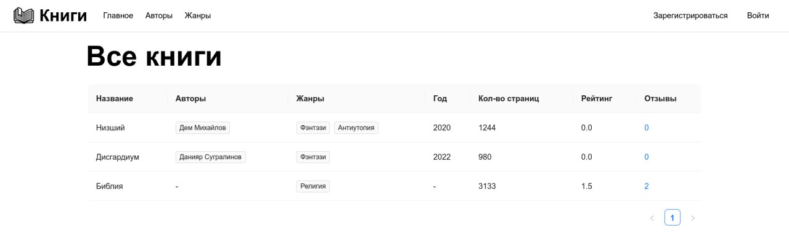
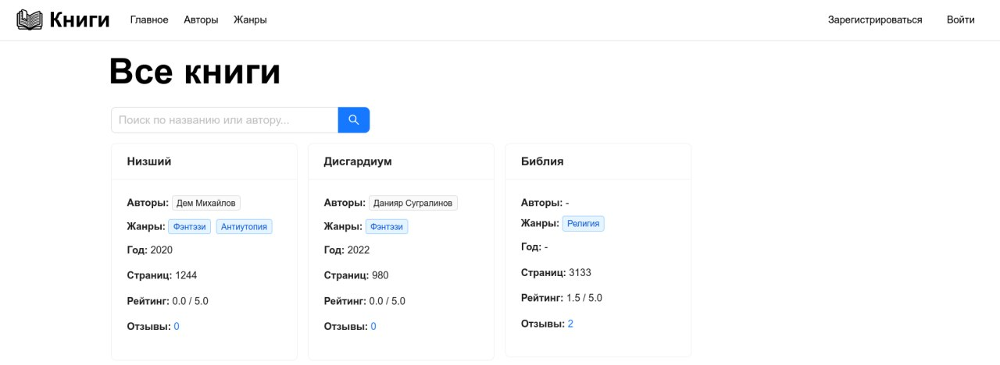

# Отчет по лабораторной работе: «Улучшение UX»

## 1. Оценка текущего состояния ПО по атрибутам Usability (ISO/IEC 25010:2011)

| Атрибут качества | Краткая оценка текущего состояния («As Is») |
| :--- | :--- |
| **Распознаваемость соответствия** | **Низкая.** Приложение позиционируется как «Онлайн-библиотека», но главный экран выглядит как административная панель базы данных (сухая таблица). Пользователь не сразу считывает контекст каталога книг. |
| **Обучаемость** | **Средняя.** Используются стандартные паттерны Ant Design, однако отсутствуют подсказки (tooltips) для кнопок действий (редактирование, удаление), что требует от пользователя догадываться об их назначении. |
| **Используемость (операбельность)** | **Низкая.** Отсутствует поиск и фильтрация. При увеличении количества книг найти нужную становится сложно. |
| **Защита от ошибок пользователя** | **Высокая.** Реализована модальная валидация (ограничения на длину полей, обязательность), а также подтверждение удалений (pop-up "Вы уверены?"). Добавлена блокировка действий администратора над своим же аккаунтом. |
| **Эстетика GUI** | **Низкая.** Интерфейс перегружен табличным представлением. Книги не имеют визуального акцента, выглядит скучно. |
| **Доступность** | **Средняя.** Ant Design предоставляет базовую ARIA-разметку «из коробки», но кастомные элементы (иконки без текста) не имеют достаточного описания. |

## 2. Выбранные пути улучшения UX и их обоснование

На основе проведенного анализа были выбраны следующие направления рефакторинга интерфейса:

1. **Переход от табличного представления к карточному (Сетка карточек для книг).**
    * *Обоснование:* Карточки (Cards) — это стандартный паттерн для онлайн-библиотек. Это радикально улучшит **Эстетику GUI** и **Распознаваемость соответствия**. Пользователю будет гораздо приятнее и привычнее просматривать каталог.
2. **Внедрение строки поиска (Search Bar).**
    * *Обоснование:* Улучшает **Используемость (операбельность)**. Позволяет мгновенно находить нужную книгу по автору или названию без необходимости сканировать весь список.
3. **Добавление Tooltips (всплывающих подсказок) к элементам управления.**
    * *Обоснование:* Решает проблемы с **Обучаемостью** и **Доступностью**. Теперь при наведении на иконки «Карандаш» или «Корзина» в любой таблице пользователь будет точно знать, какое действие произойдет.
4. **Улучшение пустых состояний (Empty States).**
    * *Обоснование:* Если результаты поиска не дали результатов, вместо пустоты должна отображаться понятная графика.

## 3. Реализация улучшений (Сравнение «До» и «После»)

### 3.1. Главный экран каталога книг

**До:** Книги отображались в виде сплошной таблицы. Жанры и авторы сливались в единый текст. Отсутствовал поиск.

**После:** Книги представлены в виде адаптивной сетки карточек. Добавлена строка живого поиска по названию и автору. Интерфейс стал современным и интуитивно понятным.

## Заключение

Проведенный рефакторинг UI/UX позволил превратить административно-ориентированный интерфейс в современный пользовательский продукт. Использование адаптивных карточек вместо таблиц сделало платформу визуально похожей на настоящую онлайн-библиотеку, а добавление живого поиска и всплывающих подсказок значительно повысило уровень комфорта для пользователей.